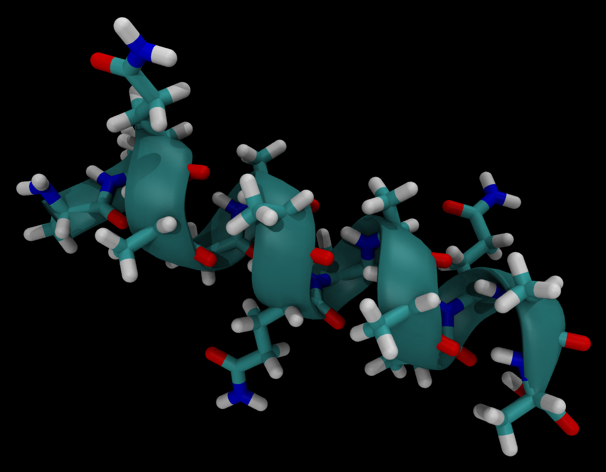

Helix-forming Peptide (AAQAA)<sub>3</sub>
=========================================



The default force field used for simulating the peptide is `AMBER-03`.

To simulate a molecule of (AAQAA)<sub>3</sub> in a vacuum:

```
python simulation.py
```
