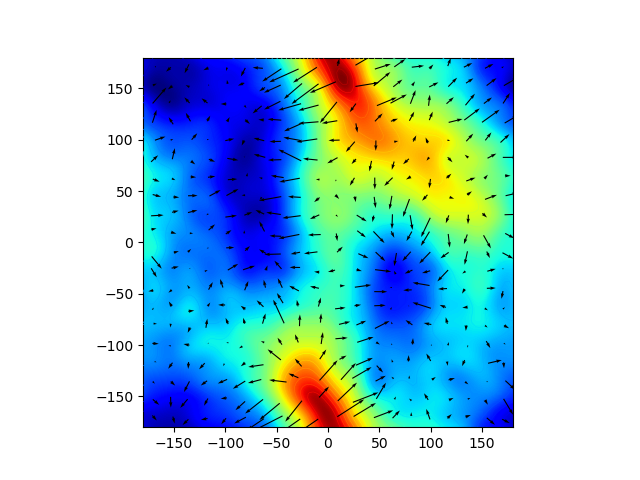
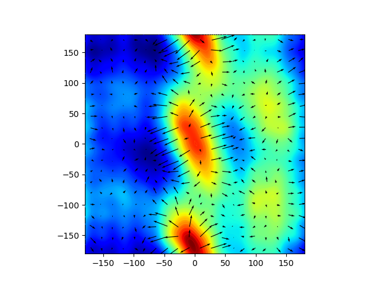

Alanine Dipeptide
=================

Ramanchandran Free-Energy Surfaces
----------------------------------

Dipeptide in vacuum        |  Dipeptide in solution
:-------------------------:|:-------------------------:
            |  


The default force field used for the dipeptide is `AMBER-03`.

To simulate a molecule of alanine dipeptide in a vacuum:

```
python alanine_dipeptide.py
```

To perform post-processing:

```
python analysis.py
``` 

To simulate a molecule of alanine dipeptide in explicit water using
OpenMM's `CUDA` platform:

```
python alanine_dipeptide.py --water tip3p --platform CUDA
```

Note: other available water models are `spce`, `tip4pew`, and `tip5p`.
